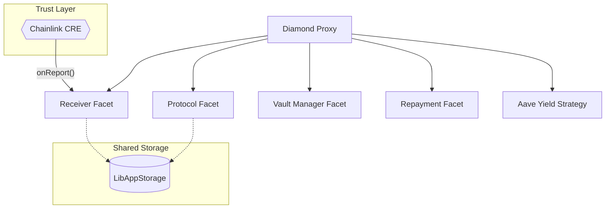

# HODL: Multi-Chain Hub Protocol

The HODL Hub is the decentralized settlement and liquidity engine of the HODL protocol. While frequently deployed on high-throughput networks like ETH, Base, BSC..., the Hub is designed to be chain-agnostic, allowing HODL to scale liquidity across multiple "Hub" environments simultaneously.

Built on the EIP-2535 Diamond Standard, the Hub provides a modular architecture for cross-chain collateral management, yield optimization, and fiat-abstraction lending.

## 🏗 Architecture: The HODL Diamond

The Hub utilizes a Diamond proxy pattern to manage complex logic across multiple facets while maintaining a unified state via LibAppStorage.



## Core Facets

- `ReceiverFacet` **(The Gateway)**: The entry point for all cross-chain instructions. It contains the onReport function which processes verified data from the Spokes.

- `PositionManagerFacet`: Global configuration, fee structures, and the CRE Access Control list.

- `VaultManagerFacet`: Manages ERC4626-style vaults and tracks global LTV (Loan-to-Value) ratios for supported collateral.

- `ProtocolFacet`: Processes stablecoin settlements and emits the LoanRepaymentX events required for collateral release.

- `YieldStrategyFacet`: Automatically routes collateral into Aave-style pools to offset borrower interest through productive yield.

## 🔒 Security: The ReceiverFacet & CRE

The `ReceiverFacet` implements a strict security model to ensure the integrity of the cross-chain lending loop:

`onReport(bytes calldata report)`

This is the most sensitive function in the protocol.

1. Access Control: It is protected by an modifier. Only the authorized Chainlink Runtime Environment address can successfully call this function.

2. Execution: Upon receiving a report, the facet decodes the instructions and interacts with the `PositionManager` to authorize the issuance of stable assets.

3. Integrity: Because the CRE is a trust-minimized environment, the Hub can safely assume the data in the report has been validated against Spoke-side events.

## 🚀 Key Features

- **Multi-Hub Deployment**: Can be deployed on Base, Arbitrum, or any EVM-compatible chain to serve as a regional or global liquidity source.

- **CRE-Driven Automation**: No manual bridging. The CRE triggers the Hub logic automatically based on Spoke-side activity.

- **Productive Collateral**: Integrated Aave yield layer ensures that locked assets are not sitting idle.

- **Diamond Modularity**: New facets (like advanced liquidation logic or new yield strategies) can be added without migrating liquidity.

## 💻 Installation & Setup

### Prerequisites

- Foundry toolchain (forge, cast, anvil)

- Node.js >= 18 (for selector generation)

### Install

```sh
git clone https://github.com/HODL-Fi/lendbit-localised.git
cd lendbit-localised

# Install Foundry dependencies
forge install
# Install JS dependencies for scripts
npm install
```

## 🧪 Testing & Deployment

### Local Simulation

The suite includes specialized tests for the ReceiverFacet to ensure the onlyCRE restriction and report decoding logic are robust.

```sh
# Run entire suite
forge test

# Test CRE report processing
forge test --match-test testOnReport
```

### Deployment (Foundry Script)

The deployment script initializes the Diamond and sets the initial CRE authorized address in storage.

```sh
forge script scripts/Deploy.s.sol --rpc-url <YOUR_RPC_URL> --broadcast
```

## 📈 Yield Strategy (Aave Integration)

The protocol routes a configurable percentage of collateral into Aave to generate yield.

- **Borrower Benefit**: Yield earned is used to offset the accrued interest on the fiat loan.

- **Protocol Benefit**: A small "Reserve Factor" is taken from the yield to fund the HODL treasury.

- **Safety**: Withdrawal and liquidation logic automatically unwinds these positions before releasing collateral.

## Other Links
- **[Hodl CRE WOrkflow](https://github.com/HODL-Fi/hodl-workflow)**
- **[Spoke Smart Contract](https://github.com/HODL-Fi/lendbit-localised/blob/lendbit-spoke/contracts/LendbitSpoke.sol)**
- **[Try Out Hodl @ avax.joinhodl.com](https://avax.joinhodl.com)**