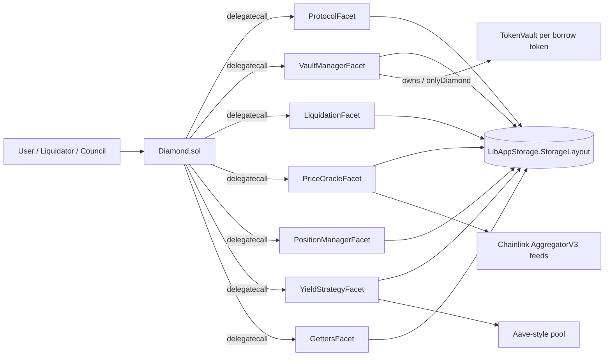

## Diamond proxy

`contracts/Diamond.sol` is the sole entry point. It stores the EIP-2535 selector table and dispatches every call to a facet via `delegatecall`. Application state is **not** stored in facets — all facets share one storage layout through `LibAppStorage.appStorage()`, so every facet call mutates the same diamond storage.



## Facets

| Facet | Responsibility |
|---|---|
| `ProtocolFacet` | Collateral deposit/withdraw, borrow, repay, tenured loans, signed borrow requests, collateral/LTV/rate configuration |
| `VaultManagerFacet` | Liquidity deposit/withdraw, vault deployment and upgrade, token pause/resume, vault parameters |
| `PositionManagerFacet` | Position creation and transfer, forced admin transfer, whitelist, request-borrow signer |
| `LiquidationFacet` | Liquidatability checks; liquidation of open-ended borrows and fixed-tenure loans |
| `PriceOracleFacet` | Chainlink feed reads, staleness configuration, Chainlink Functions setup and fulfillment |
| `YieldStrategyFacet` | Yield configuration, collateral rebalancing, user claims, protocol harvests |
| `GettersFacet` | Read-only views |
| `DiamondCutFacet` / `DiamondLoupeFacet` / `OwnershipFacet` | EIP-2535 plumbing (reference implementation) |

Most implementation logic lives in the paired libraries: `LibProtocol`, `LibVaultManager`, `LibLiquidation`, `LibPriceOracle`, `LibYieldStrategy`, `LibPositionManager`. Facets are thin dispatch layers; audit the libraries.

## Shared storage

`LibAppStorage.StorageLayout` holds all protocol state. Key regions:

<AccordionGroup>
  <Accordion title="Positions and whitelist">
    `s_nextPositionId`, `s_positionOwner[positionId]`, `s_ownerPosition[user]` (must stay reciprocal), `isWhitelisted[user]`, `s_requestBorrowSigner`, `s_requestBorrowNonceUsed[contract][nonce]`.
  </Accordion>
  <Accordion title="Borrow tokens and vaults">
    `s_allSupportedTokens`, `s_supportedToken[token]`, `i_tokenVault[token]`, `s_tokenVaultConfig[token]`, `s_tokenPriceFeed[token]`.
  </Accordion>
  <Accordion title="Collateral">
    `s_allCollateralTokens`, `s_supportedCollateralTokens[token]`, `s_collateralTokenLTV[token]`, `s_collateralLiquidationThreshold[token]`, `s_positionCollateral[positionId][token]`, `s_totalCollateralDeposited[token]`.
  </Accordion>
  <Accordion title="Debt">
    Open-ended: `s_positionBorrowed[positionId][token]`, `s_positionBorrowedLastUpdate[positionId][token]`. Tenured: `s_nextLoanId`, `s_loans[loanId]`, `s_positionActiveLoanIds`, `s_positionClosedLoanIds`, `s_loanPrincipal`, `s_loanStartTime`.
  </Accordion>
  <Accordion title="Oracle and Chainlink Functions">
    `s_tokenPriceFeed[token]`, `s_priceFeedStalenessThreshold[token]`, `i_router`, `i_linkToken`, `s_subscriptionId`, `s_donID`, `s_source`, `s_functionResponse[requestId]`, `s_isKeeper[keeper]`.
  </Accordion>
  <Accordion title="Yield and reentrancy">
    `s_yieldConfigs[token]`, `s_positionYield[positionId][token]`, `s_reentrancyStatus`.
  </Accordion>
</AccordionGroup>

## TokenVault model

Each supported borrow token gets a dedicated `TokenVault` — an ERC4626-style vault whose privileged operations are `onlyDiamond`. It tracks `interestRate`, `totalBorrows`, `fixedBorrows` and `fixedRateProduct`, `totalAccruedInterest`, `totalBadDebt`, `reserveFactor`, pause state, and share balances.

```text
totalAssets() = underlying balance + totalBorrows + totalAccruedInterest + pending interest
```

Share price therefore depends on **both** real token custody and internal debt accounting.

Two accrual legs exist:

- **Floating (pooled) borrows** accrue at the mutable vault `interestRate`.
- **Fixed-tenure loans** accrue at their own snapshotted rate via `fixedRateProduct` (Σ principal·rate), so a governance rate change cannot mint phantom interest on fixed loans.

LP interest is credited **net of the reserve factor** at accrual time (`_pendingInterest`); the protocol's slice is realized into the reserve at repayment.

<Warning>
Governance rate or reserve-factor changes while floating borrows are open cause LP-side accounting drift. This is a documented accepted risk under a set-once-parameter posture — see [Known issues](/audit/known-issues).
</Warning>

## Native-token handling

The native asset (ETH on Base, BNB on BSC) is represented by the sentinel address `0x0000000000000000000000000000000000000001`. It is collateral-only: no ERC4626 vault is deployed for it, so no native borrows or repays exist (the `msg.value` branch in `_allowanceAndBalanceCheck` is dead code by construction).
